# Smellit Perfume Store
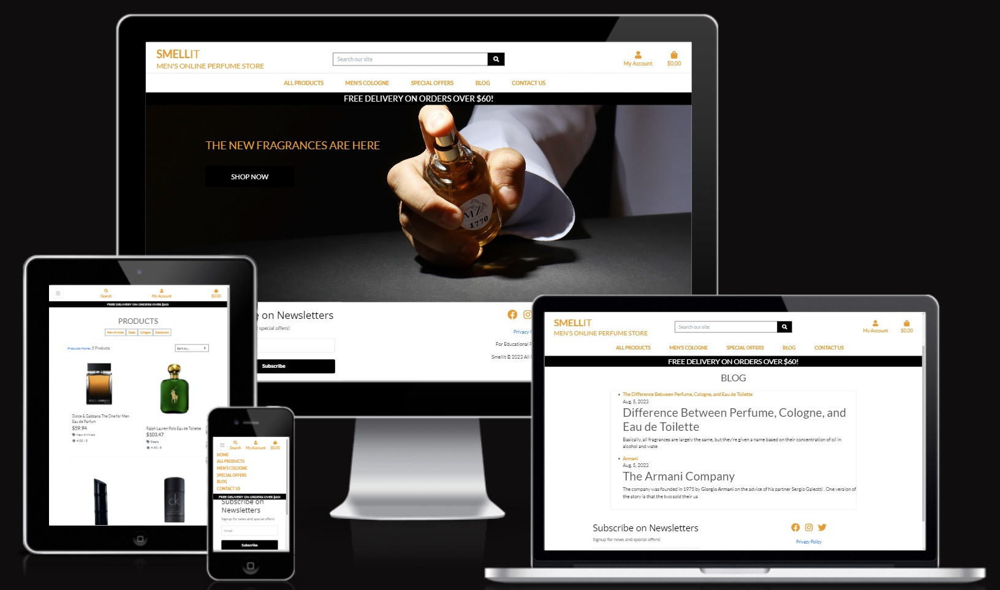
## A men's perfume e-commerce store online.
An E-commerce store for men who seek to buy perfumes, colognes and deodorants online. You can also find information about new fragrances, brands, differences between them all and more in the blog section. 

### - By Rasmus Persson

### [Live Site](https://smellit-perfume-store-8571815b705d.herokuapp.com/)

### [Repository](https://github.com/Mysanthropium/smellit-perfume-store)

## Table of contents
- UX
- 

# UX
### Goals For This Website:
The goal is to give the user a nice experience throughout the whole website, on any device. To be able to purchase perfumes from different brands that's been handpicked by the owner, and read news about brands and the evolution of perfumes throughout the world on the blog. 
* Users have the possibility to register for an account to save their information for easier purchases in the future.
* Read posts on the blog and find other useful sources about the difference between perfume and cologne for example.
* Sign up for newsletters to be able to catch all the latest news whenever they get out.
* Contact the owner to give feedback, blog requests or general questions.
* The target audience is mostly males between 16-55 years old.

#### The business is a B2C e-commerce platform

## Design
Since I like perfumes and didn't really know anything about it except that they smell good, I thought this would be a great idea for me to be able to research a bit more about the differences and how they are made. That's how I also came up with the idea of adding a blog to share som research with the users.

### Wireframes
I made my wireframes using [Figma Wireframes](https://www.figma.com/templates/wireframe-kits/)

### Desktop view

>Home page

>Product page

>Blog page

### Mobile view

>Home page

>Product page

>Blog page

## Features
- Navigation\
At the top left corner of the page there's a logo which will take the user to the homepage. In the top middle there's a navbar which will collapse into a burger icon on smaller devices, containing a dropdown menu of All Products(sorting), a Men's Cologne dropdown menu(categories), a Special Offers dropdown menu, a link to the Blog page and a link to Contact us page. Then at the top right corner there's a dropdown menu of My Account, depending if the user is logged in or not the menu list will change accordingly.

    - Not logged in users:
        - All Products
            - By Price
            - By Rating
            - By Category
            - All Products
        - Men's Cologne
            - Cologne
            - Deodorant
            - All Products
        - Special Offers
            - New Arrivals
            - Deals
            - All Specials
        - Blog
        - Contact Us
        - My Account
            - Register
            - Login
        - Shopping Bag
    - Logged in users:
        - All Products
            - By Price
            - By Rating
            - By Category
            - All Products
        - Men's Cologne
            - Cologne
            - Deodorant
            - All Products
        - Special Offers
            - New Arrivals
            - Deals
            - All Specials
        - Blog
        - Contact Us
        - My Account
            - My Profile
            - Logout
        - Shopping Bag
    - Superusers will see all of the above plus:
        - My Account
            - Product Management
            - Add Blog Post

 

Home Page

 
- The home page consists of a background image with a shop now button to get to the products page.

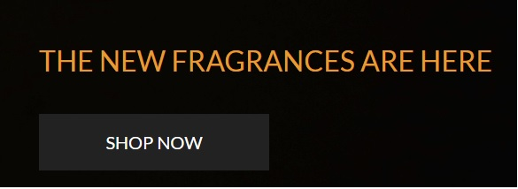

 

Products Page

 
- The products page consists of images, price, rating and category of the products listed on that page. In the top right corner there is also a sort by dropdown menu and in the bottom right there's a small arrow icon that takes you to the top of the page.

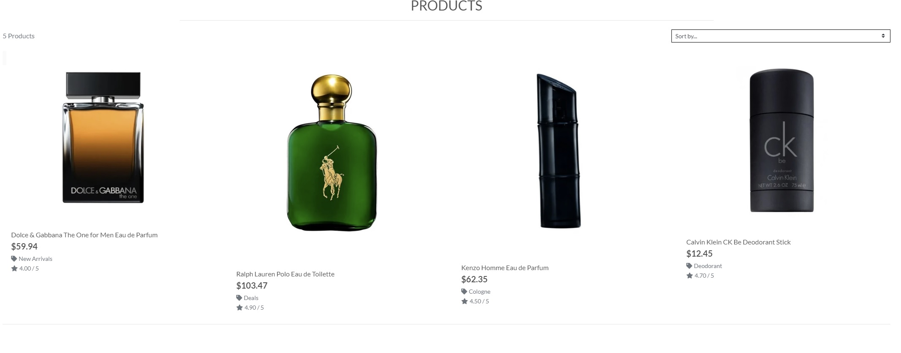

 

Product Detail Page

 
- On the product detail page users can read a description of the product, aswell as price, rating and category. There's the possibility to choose quantity of the product. There's a button to add this product to the bag and a button to go back to products page and keep shopping. 

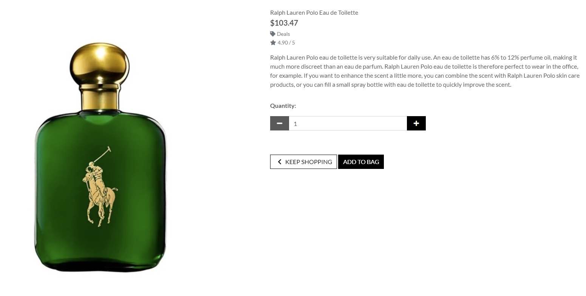

 

Footer

 
- The footer exist on all pages and consists of social links, privacy policy and a form to subscribe to newsletters.

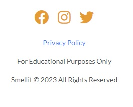

 

Blog

 
- On the blog, users can browse the posts and click on them to get to the blog details.

 

Contact Us

 
- Contact page features a form to fill out to send emails to the store owner.

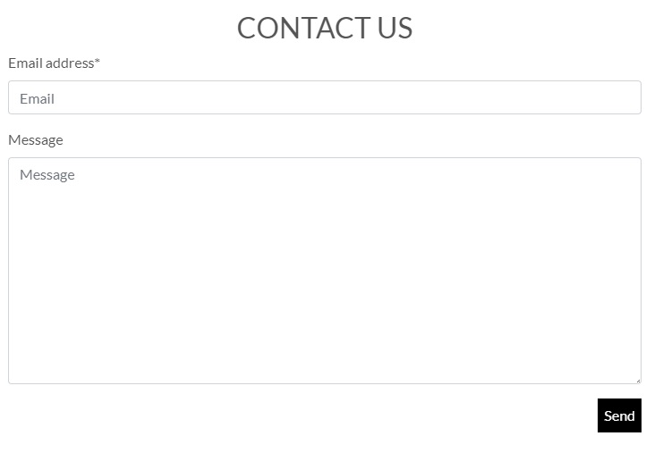

 

Sign Up Page

 
- On this page users can sign up for an account to save billing information for future checkouts.

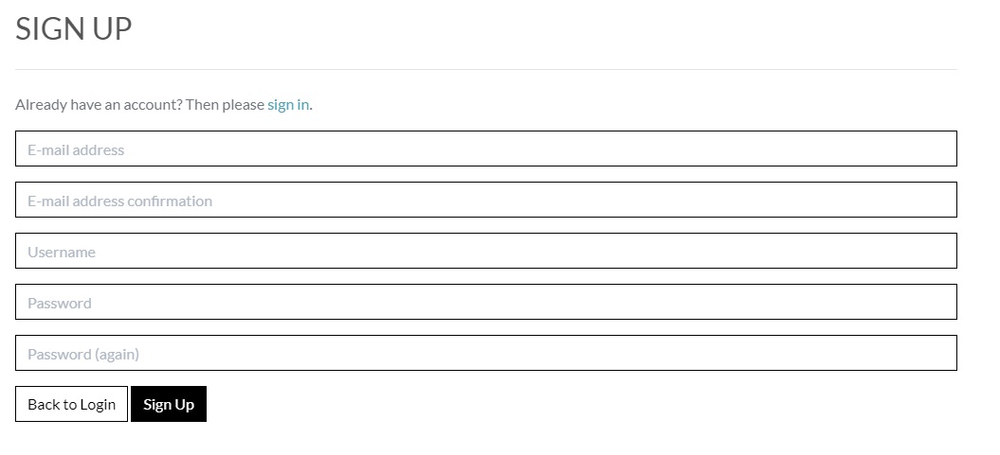

 

Sign In Page

 
- On this page registered users can sign in to be able to use its benefits.

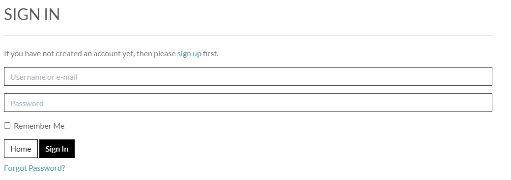

 

Profile Page

 
- On the profile page signed in users can edit their billing information and see their order history.

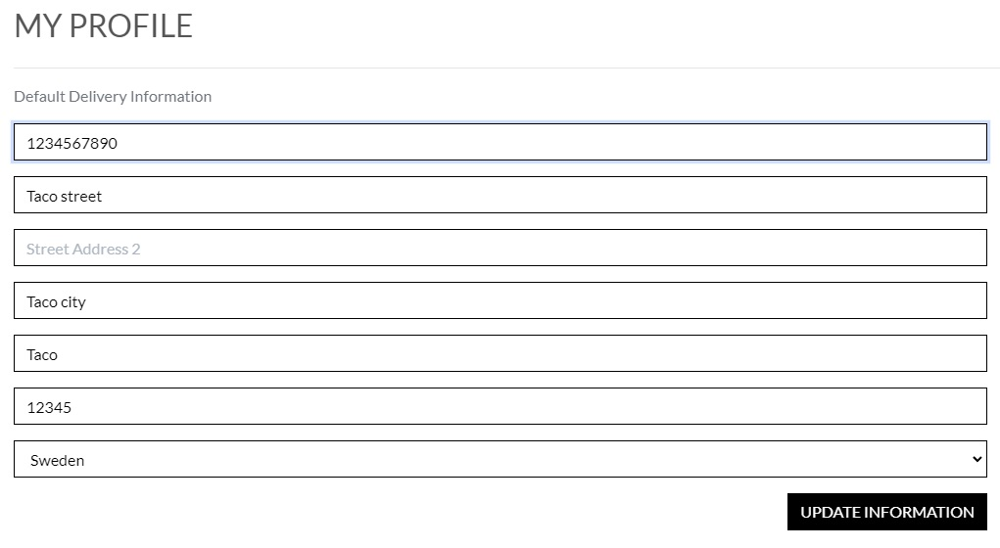

 

Shopping Bag

 
- The shopping bag consists of a summary of what the user added to the bag, quantity, price and subtotal. The ability to update or remove products. In the bottom right there's a secure checkout button to take the user to the checkout page, or a keep shopping button to get back to products.

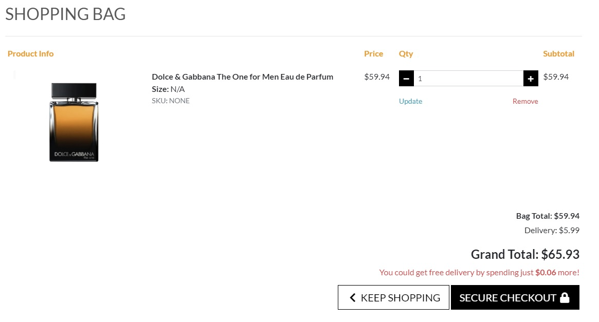

 

Checkout

 
- The checkout page consists of a form to complete the order, and a order summary with a grand total price. To complete the order use the Complete Order button, or choose to adjust bag.

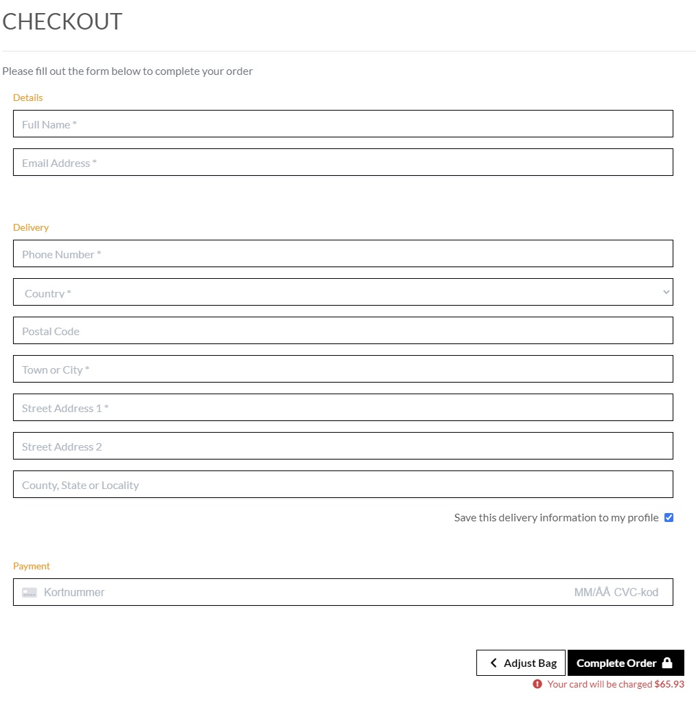

 

Notifications

 
- The website show success, error and info messages in the top right corner.

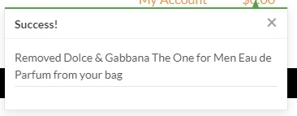

 

Superuser/Product Management Page

 
- As superuser it's possible to add products in the front end.

 

Superuser/Edit or Delete a product

 
- The home page consists of a background image with a shop now button to get to the products page.

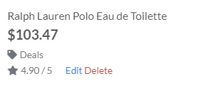

 

Superuser/Add Blog Post

 
- As superuser it's possible to add blog posts.

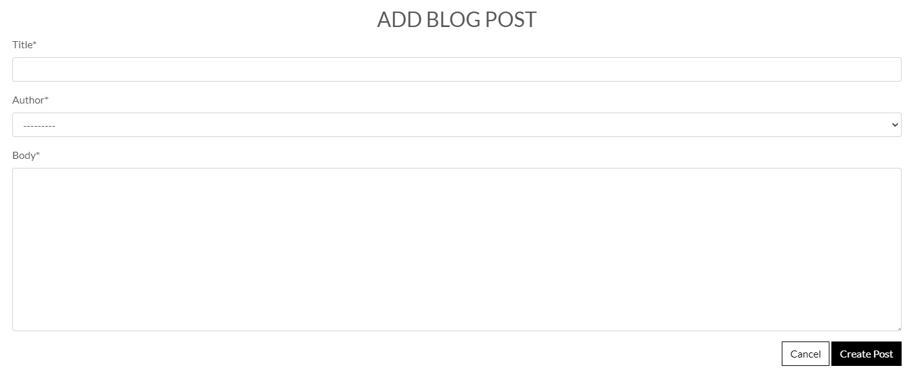

 

Superuser/Edit or Delete blog

 
- As superuser it's possible to edit or delete blog posts both from blog page and blog post detail page.

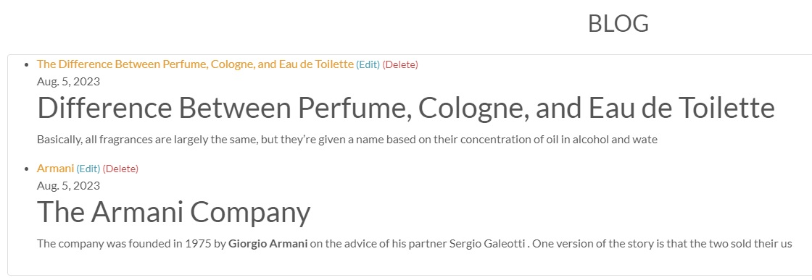

## Features Left To Implement
* Profiles could be expanded.
* Maybe widen the blog, let users create posts aswell.
* Implement more products and categories, for example men's skin care.
* To be able to add more images to product details.
* A FAQ page.

# User Stories

* Link to my user stories is [here](https://github.com/users/Mysanthropium/projects/5)

# Testing
* Link to the testing page is [here](https://github.com/Mysanthropium/smellit-perfume-store/blob/main/TESTING.md)

# Technologies Used
### Languages
- HTML5
- CSS
- Python
- JavaScript

### Frameworks
- Django
- Bootstrap

### Libraries
- Font Awesome
- Google Fonts

### Other Tools Used
- GitHub, used to store code and user stories
- Gitpod, my IDE of choice for the application
- Git, used for version control
- Heroku, for deployment and hosting of the application
- PostgreSQL, used for storing data for this project
- AWS S3 Bucket, my choice for hosting static files and media files
- Stripe, used for secure payment and to validate credit cards
- [Freeformatter](https://www.freeformatter.com/), used to make my code look nicer and cleaner
- [Temp-mail](https://temp-mail.org/sv/), used to test mail functions on the page
- [Figma](https://www.figma.com/templates/wireframe-kits/), my wireframe tool of choice

### Tools used for testing
- W3C HTML Validator
- W3C CSS Validator
- PEP8
- JSHint
- DevTools Lighthouse
- DevTools

To find more about testing, click [here](https://github.com/Mysanthropium/smellit-perfume-store/blob/main/TESTING.md).

[Back to top](#a-mens-perfume-e-commerce-store-online)

## Deployment
### Version Control
Using GitPod to push code to main repository in GitHub.
* In GitPod terminal use "git add ." to add the changes.
* Then use "git commit -m "push comment"" to make a comment to your push.
* Finally use "git push" to push the update to the repository on GitHub.

### App Deployment
Using Heroku for app deployment.
- Create a new app on your dashboard.
- Navigate to "Settings" in your new app.
- Click reveal config vars and add these:

        - DATABASE_URL
        - PORT
        - SECRET_KEY
        - AWS_ACCESS_KEY_ID
        - AWS_SECRET_ACCESS_KEY
        - EMAIL_HOST_PASS
        - EMAIL_HOST_USER
        - STRIPE_PUBLIC_KEY
        - STRIPE_SECRET_KEY
        - STRIPE_WH_SECRET
        - USE_AWS
These are the keys for the final project.

- Then navigate to deploy tab and connect to github, choose Enable Automatic Deploys for an easier workflow.

# Credits
### [YouTube](https://www.youtube.com/)
* For having great learning content.

### [Django](https://www.djangoproject.com/)
* For built in admin panel and additional useful features.

### [Python](python.org)
* For beginner friendly tutorials.

### [GitHub](docs.github.com)
* For learning how to document a nice looking readme.

### [Bootstrap](https://getbootstrap.com/)
* For helping me style the project.

### Code Institute
* This project is a part of the course content.

### [John Elder](https://www.youtube.com/@Codemycom)
* For well made tutorials on how to make a blog that's easy to understand.

### Code base
* I followed along with the walkthrough project Boutique Ado to have as a base for this project.

### [CSS-tricks](https://css-tricks.com/)
* To help with css issues, like sticking the footer to bottom of the page.

# Acknowledgements
* Students at code institute on slack for solving issues together.
* Tutors at code intitute for being of great help whenever needed.

[Back to top](#a-mens-perfume-e-commerce-store-online)